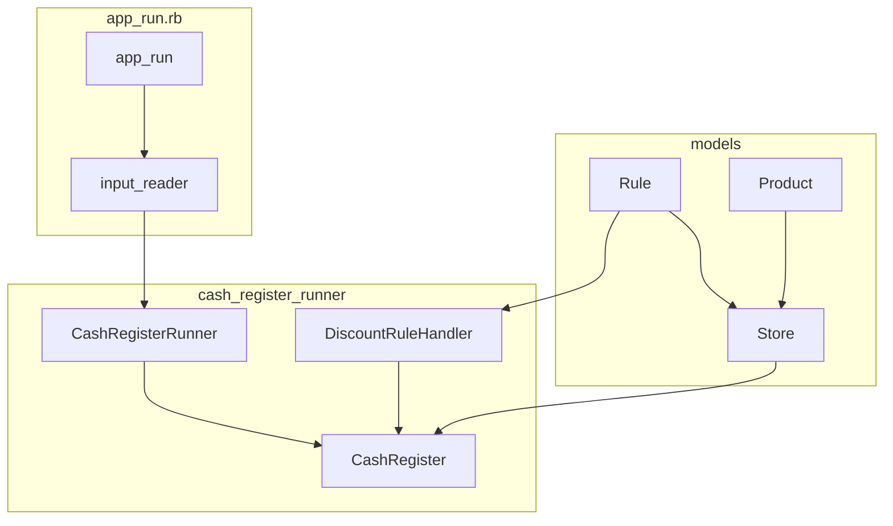

## Project
This is a simple project that implements a cash register like application. To understand better the requirements, please check task_description.txt file.

## Overview
The following chart briefly explains the what is the structure and/or the flow (some services were ommited, please check #Files descriptions section).



The execution flow is:
1. After running app_run an input reader (IR) is selected and used to initialize the `CashRegisterRunner`;
2. The `CashRegisterRunner` loads the products and initializes a `CashRegister` for each product list read by input;
3. Each product is scanned by `CashRegister` (which also "adds" that product to the basket);
4. When counting the `total`, it is checked whether there is any discount rule for each product in the basket;
5. The result is print on the STDOUT following the pattern
`products: <product_list> | <total value calculated> (<expected value>)`


## How to run
The project was built using ruby `3.2.2`, after cloning the project and navigating to the project directory (`amenitiz`), please ensure you have the ruby `3.2.2` installed. Then, please run:

```bash
gem install bundler
bundle install
```
You can run the project by running:
```
ruby app_run.rb
```
Alternatively you execute it by running:
```
./app_run.rb
```
However you may need to make sure `app_run.rb` is executable, to achieve it please run:
```
chmod u+x app_run.rb
```
The project can be run passing the directive `--file file_name.csv`, file_name.csv should be a csv with 2 columns, the first is a list of product code (separated by semicolon character), the second column is an expected total value used to compare with the calculated tota, an example can be checked on `fixtures/test_data.csv`.

If no file is provided, please just follow the instructions.

## Files

#### `models/*.rb`
These are the models used in the project, rules and products are loaded considering `config/rules.yml` and `config/products.yml` respectively

#### services/cash_register.rb

#### services/cash_register_runner.rb
After loading products and initialize a `Store`, this service starts a `cash_register` and process each product list provided as input. Initially this file was utilised as `app_run.rb` is now, but the file became big, so I extract it into a new service;

#### services/discount_rule_handler.rb
Class that applies the discount if there is any. The rules could apply either a "relative discount" (x% off) or an "absolute discount" (€1.2 off) If no rule is provided it simply calculates `amount of product` X `price per product`

#### services/default_input_reader.rb
Used to read the input from STDIN, that input will be used by cash register runner

#### services/file_reader.rb
Used to read the input from a file, that input will be used by cash register runner

## Future implementations/improvement

#### Ux
While running the application with no options, if anything goes wrong the application stop; It could be fault tolerant and keep running forever (or until the user says to stop), like a real life cash register

#### Registering Products
After improving the UX as mentioned previously, it could be implemented the ability of users to register new products interatively. In fact there is a method which does that, it was thought about in the beginning of the implementation, but in the end loading products from the file was easier and quicker

#### Registers Rules
The same as before, but for rules.

#### Dockerizing the application
To avoid mismatch of ruby version and make it more smooth and transparent for the user, docker could be used

#### Improve tests on DefaultInputRead
It was a bit tricky to find out how to test `gets` method call, I've tried some attempts but with no success, this could be definitely improved


